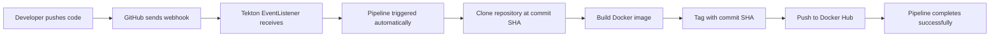

# Tekton CI Pipeline with GitHub Webhook Automation

This project provides a complete Continuous Integration (CI) pipeline using Tekton that automatically builds and pushes Docker images to Docker Hub whenever you push code to your GitHub repository.

## 🎯 What This Pipeline Does

1. **Monitors GitHub Repository** - Listens for push events via webhooks
2. **Clones Source Code** - Automatically clones the exact commit that triggered the pipeline
3. **Builds Docker Image** - Uses your Dockerfile to build container images
4. **Tags with Commit SHA** - Tags images with short commit SHA (e.g., `myapp:a1b2c3d4`)
5. **Pushes to Docker Hub** - Automatically publishes images to your Docker Hub repository

## 📋 Prerequisites

Before starting, ensure you have:

- ✅ **Kubernetes cluster** (minikube, kind, or cloud cluster)
- ✅ **kubectl** configured to access your cluster
- ✅ **tkn CLI** installed (Tekton CLI)
- ✅ **Docker Hub account** with username and password/token
- ✅ **GitHub repository** with a Dockerfile
- ✅ **ngrok account** (for webhook exposure) - Sign up at https://ngrok.com

## 🚀 Step-by-Step Deployment Guide

### Phase 1: Core Pipeline Setup

#### Step 1: Deploy Core Tekton CI Pipeline
```bash
# This installs Tekton Pipelines and sets up the basic CI components
./setup-ci-pipeline.sh
```

**What this does:**
- Installs Tekton Pipelines in your cluster
- Creates `tekton-ci` namespace
- Deploys tasks, pipeline, secrets, RBAC, and storage

#### Step 2: Configure Docker Hub Credentials
```bash
# Edit the secrets file with your Docker Hub credentials
nano secrets.yaml

# Update these lines:
# username: "YOUR_DOCKERHUB_USERNAME"  → username: "your-actual-username"
# password: "YOUR_DOCKERHUB_PASSWORD"  → password: "your-actual-password-or-token"

# Apply the updated secrets
kubectl apply -f secrets.yaml
```

#### Step 3: Test Manual Pipeline Run
```bash
# Edit the pipeline run with your repository details
nano simple-pipelinerun.yaml

# Update these parameters:
# git-url: "https://github.com/your-username/your-repo.git"
# image-name: "your-dockerhub-username/your-app-name"

# Run the pipeline manually to test
kubectl create -f simple-pipelinerun.yaml

# Monitor the pipeline execution
tkn pipelinerun logs --last -n tekton-ci -f
```

**✅ Verify:** Pipeline should successfully clone, build, and push your Docker image.

---

### Phase 2: Webhook Automation Setup

#### Step 4: Deploy Webhook Components
```bash
cd webhooks/

# Deploy all webhook automation components
./deploy-webhook.sh
```

**What this does:**
- Installs Tekton Triggers
- Creates EventListener, TriggerBinding, TriggerTemplate
- Sets up webhook secret for GitHub authentication

#### Step 5: Expose Webhook Endpoint
```bash
# This script provides options to expose your webhook publicly
./expose-webhook.sh

# Choose option 2 for ngrok (public access needed for GitHub)
# Follow the prompts to set up ngrok tunnel
```

**Important:** You'll need your ngrok authtoken. Get it from: https://dashboard.ngrok.com/get-started/your-authtoken

#### Step 6: Configure GitHub Webhook
1. **Go to your GitHub repository**
2. **Navigate to:** Settings → Webhooks → Add webhook
3. **Configure webhook:**
   - **Payload URL:** `https://your-ngrok-url.ngrok.io` (from Step 5)
   - **Content type:** `application/json`
   - **Secret:** `mysecrettoken123` (or update in `webhook-secret.yaml`)
   - **Events:** Select "Just the push event"
   - **Active:** ✅ Checked
4. **Click "Add webhook"**

#### Step 7: Test Automated Pipeline
```bash
# Make any change to your repository
echo "# Test change" >> README.md
git add .
git commit -m "Test automated pipeline trigger"
git push origin main

# Watch your pipeline automatically trigger
tkn pipelinerun ls -n tekton-ci
tkn pipelinerun logs --last -n tekton-ci -f
```

---

## 📁 File Structure

```
Tekton-CICD/
├── buildah-task.yaml              # Docker build & push task
├── ci-pipeline-simple.yaml        # Main CI pipeline definition
├── simple-git-clone-task.yaml     # Git clone task (fixed for commit SHAs)
├── simple-pipelinerun.yaml        # Manual pipeline run template
├── namespace.yaml                 # Tekton CI namespace
├── secrets.yaml                   # Docker Hub credentials
├── serviceaccount.yaml            # Service account for pipeline
├── rbac.yaml                      # Role-based access control
├── pvc.yaml                       # Persistent volume for workspace
├── setup-ci-pipeline.sh           # Core pipeline deployment script
└── webhooks/                      # GitHub webhook automation
    ├── deploy-webhook.sh           # Deploy webhook components
    ├── expose-webhook.sh           # Expose webhook endpoint
    ├── test-webhook.sh             # Test webhook locally
    ├── webhook-event-listener.yaml # GitHub webhook listener
    ├── webhook-trigger-*.yaml      # Webhook trigger components
    └── triggers-*.yaml             # RBAC for webhook components
```

## 🔧 Configuration Files to Customize

### 1. Docker Hub Credentials (`secrets.yaml`)
```yaml
stringData:
  username: "your-dockerhub-username"    # ← Update this
  password: "your-dockerhub-password"    # ← Update this
```

### 2. Repository Settings (`simple-pipelinerun.yaml`)
```yaml
params:
  - name: git-url
    value: "https://github.com/your-username/your-repo.git"  # ← Update this
  - name: image-name
    value: "your-dockerhub-username/your-app"               # ← Update this
```

### 3. Webhook Secret (`webhook-secret.yaml`)
```yaml
stringData:
  secretToken: "mysecrettoken123"    # ← Change to a secure token
```

## 📊 Monitoring and Troubleshooting

### Monitor Pipeline Runs
```bash
# List all pipeline runs
tkn pipelinerun ls -n tekton-ci

# Follow latest pipeline logs
tkn pipelinerun logs --last -n tekton-ci -f

# View webhook-triggered runs only
kubectl get pipelinerun -n tekton-ci -l trigger.tekton.dev=github-webhook
```

### Monitor Webhook Events
```bash
# Check EventListener status
kubectl get pods -n tekton-ci -l eventlistener=github-webhook-listener

# View EventListener logs
kubectl logs -n tekton-ci -l eventlistener=github-webhook-listener

# Test webhook locally
./webhooks/test-webhook.sh
```

### Common Issues and Solutions

#### Issue: Pipeline Fails with Git Clone Error
**Solution:** Make sure your repository is public or add GitHub credentials for private repos.

#### Issue: Docker Push Fails
**Solution:** Verify Docker Hub credentials in `secrets.yaml` and ensure the repository exists.

#### Issue: Webhook Not Triggering
**Solution:** 
- Check GitHub webhook delivery logs
- Verify ngrok tunnel is active
- Ensure EventListener pod is running

#### Issue: EventListener CrashLoopBackOff
**Solution:** Apply RBAC permissions:
```bash
kubectl apply -f webhooks/triggers-el-clusterbinding.yaml
kubectl apply -f webhooks/triggers-el-rolesbinding.yaml
```

## 🎯 Pipeline Workflow



## 🔒 Security Considerations

### For Production Use:

1. **Webhook Secret:** Change default secret in `webhook-secret.yaml`
   ```bash
   # Generate secure token
   openssl rand -hex 32
   ```

2. **Docker Credentials:** Use Docker Hub access tokens instead of passwords

3. **Repository Access:** Use SSH keys or GitHub tokens for private repositories

4. **Network Security:** Use proper ingress instead of ngrok for production

5. **Resource Limits:** Set resource limits in task definitions

## 📚 Additional Resources

- [Tekton Documentation](https://tekton.dev/docs/)
- [Tekton Triggers Guide](https://tekton.dev/docs/triggers/)
- [GitHub Webhooks Documentation](https://docs.github.com/en/developers/webhooks-and-events/webhooks)
- [Docker Hub Access Tokens](https://docs.docker.com/docker-hub/access-tokens/)

## 🎉 Success Indicators

Your pipeline is working correctly when:

- ✅ Manual pipeline runs complete successfully
- ✅ Docker images appear in Docker Hub with commit SHA tags
- ✅ GitHub webhook shows successful deliveries
- ✅ Pushing code automatically triggers pipeline runs
- ✅ EventListener pod remains in `Running` state

## 📞 Support

If you encounter issues:

1. Check the troubleshooting section above
2. Review pipeline and webhook logs
3. Verify all configuration files have correct values
4. Ensure prerequisites are met

---

**Congratulations!** 🎉 You now have a fully automated CI pipeline that builds and deploys your applications with every code change!

